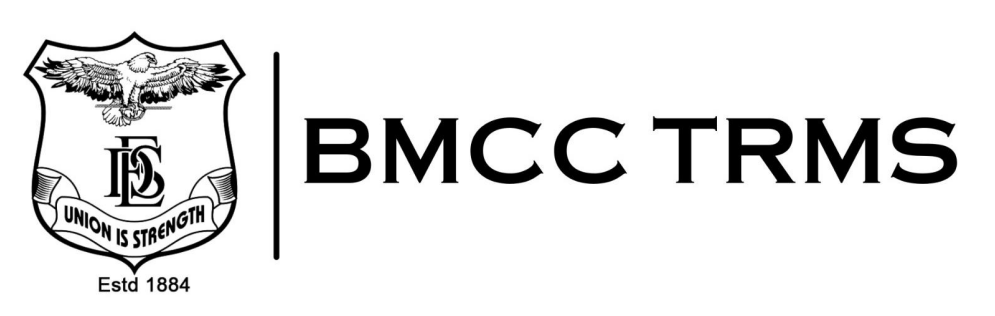

Introduction:

BMCC TRMS (Teacher Resource Management System) is an innovative
online platform revolutionizing administrative processes for educators. From
attendance tracking to lecture scheduling, BMCC TRMS automates tasks,
increasing efficiency and saving valuable time for teachers. Users can
effortlessly record attendance, generate PDF reports, manage lecture
timetables, and book facilities with ease.

Additionally, BMCC TRMS streamlines file management, group list generation,
and task automation, enabling educators to focus more on teaching and less
on administrative burdens. With its user-friendly interface and emphasis on
efficiency, BMCC TRMS empowers educators to thrive in their roles and
maximize productivity.

Note: To get an idea of the website's design and functionality, please check the images folder.
